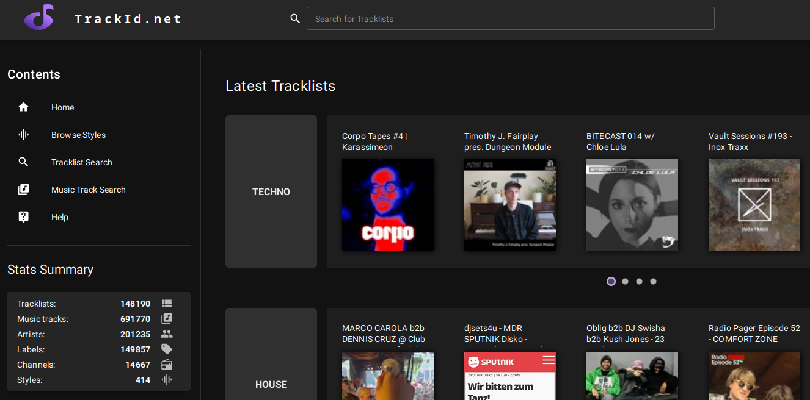
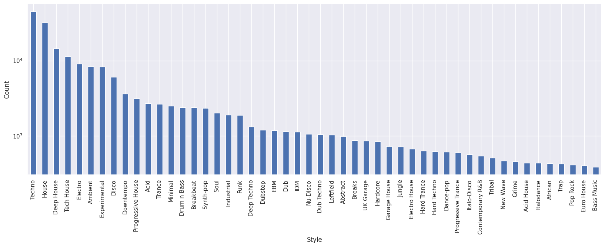
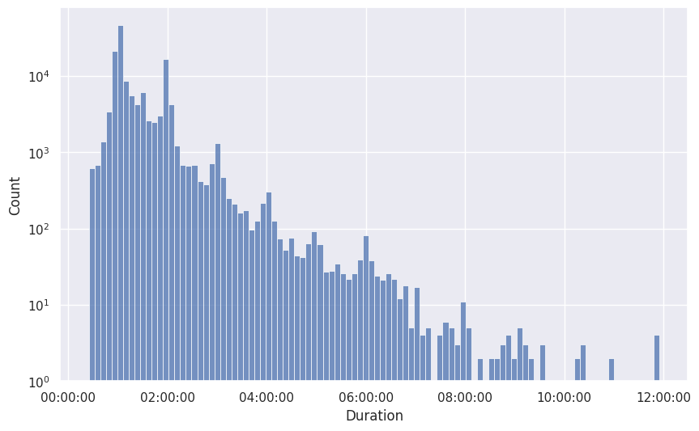
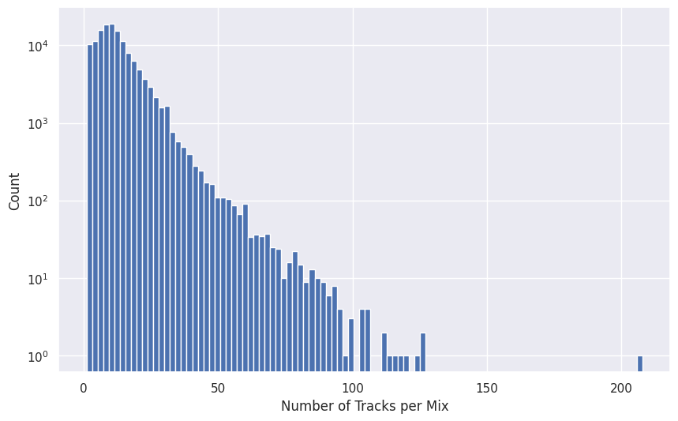
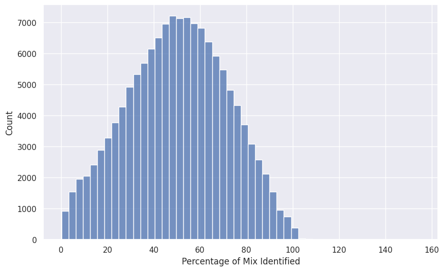
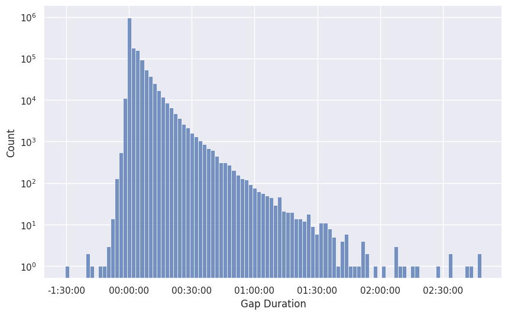

# Présentation et contenu

## Présentation

{height=70%}

---

- annotation automatique de mix par fingerprinting
- requêtes par les utilisateurs
- corrections possible par les utilisateurs

## Obtention

- contacté par mail
- [Luis](info@trackid.net) a fourni un dump PostgreSQL de la base de données du site

## Méthode

### **Fingerprinting**

> We use third party providers (Shazam, ACRCloud) and we also have our own db based on [this](https://github.com/AddictedCS/soundfingerprinting) but it's still work in progress. We also use some other trick, that's all I can say atm.

### **Segmentation**

Fusion des *matchs* contigüs

### **Estimation de style**

> The only metadata we store is audiostream styles but it's not 100% accurate, it uses Discogs API to search for musitracks and then uses some probability logic to set the styles.

## Contenu

- **Mixes**:
  - URL
  - Durée
  - Styles
- **Tracks**:
  - Titre
  - Artiste(s)
  - Label
  - Timestamps de début et de fin

## exemples

Table: extrait de `mixes.csv`

| MixId | Url                                                                | Duration | Styles                 |
| ----- | ------------------------------------------------------------------ | -------- | ---------------------- |
| 8173  | <https://soundcloud.com/resident-advisor/ra747-kabuto-20200928>    | 3642.070 | Electro, Techno        |
| 8174  | <https://soundcloud.com/resident-advisor/ra746-finn>               | 3736.007 | House                  |
| 8175  | <https://soundcloud.com/resident-advisor/ra745-sleep-d>            | 2997.002 | Techno                 |
| 8176  | <https://soundcloud.com/resident-advisor/ra744-spfdj>              | 4110.054 | Hard Techno,Techno     |
| 8177  | <https://soundcloud.com/resident-advisor/ra743-dj-holographic>     | 4974.994 | Deep House,Disco,House |
| 8178  | <https://soundcloud.com/resident-advisor/toyin-agbetu-by-404-eros> | 4169.456 | Deep House,House       |

---

Table: extrait de `tracks.csv` pour `MixId=8174`

| Artist                        | Title                                   | Label                               | StartTime | EndTime  |
| ----------------------------- | --------------------------------------- | ----------------------------------- | --------- | -------- |
| Rydims                        | Mello                                   | International DeeJay Gigolo Records | 438.925   | 474.925  |
| Hi-Ryze                       | Cyberia (Lo Pass Mix)                   | Frame of Mind                       | 832.925   | 1060.925 |
| Martha Wash                   | Runaround                               | RCA Records Label                   | 1087.925  | 1180.925 |
| DreamHouse                    | Jump and Prance-Dream Mix               | Cabaret                             | 1232.     | 1346.925 |
| Smokin Beats featuring Conroy | Times Are Changin (Smokin Dub)          | Smokin Beats                        | 1414.925  | 1720.925 |
| Ralphi Rosario                | Bop Track (Original Version)            | Underground Construction            | 1614.925  | 1739.925 |
| Victoria Newton               | I Saw the Future (Wildcat's Ragage Dub) | Fresh Records UK                    | 1865.925  | 2061.925 |
| Gage                          | Untitled (Outro)                        | 2 B REAL                            | 2502.925  | 2645.925 |
| Shanique Marie, Finn          | Movers                                  | Local Action                        | 2636.925  | 2930.925 |

## Et les audios ?

**Mix**: tous téléchargeables facilement avec [`yt-dlp`](https://github.com/yt-dlp/yt-dlp)

**Tracks**: combinaison de recherche sur [youtube-music](https://music.youtube.com/) + `yt-dlp`

- disponibilité aléatoire
- pas de garantie de trouver une track, ni d'avoir la bonne version, ni de sa qualité

=> **`downloader.py`**

# Analyse

## Quelques statistiques

- Nombre de mix: **136231**
- Nombre de tracks uniques: **666625**
- Durée totale des mix: **189511h 49m 03s**

---

{height=80%}

---

{height=80%}

---

{height=80%}

---

{height=80%}

---

{height=80%}

## Résumé

- **Dataset inutilisable tel quel**
  - Faux positifs / faux négatifs du fingerprinting
  - Timestamps peu fiables
  - Styles sous- et sur-représentés
  - Disponibilité des audios incertaine
- **Mais**
  - Validité écologique
  - Grande variété
  - Un plus petit dataset de meilleure qualité se cache à l'intérieur
