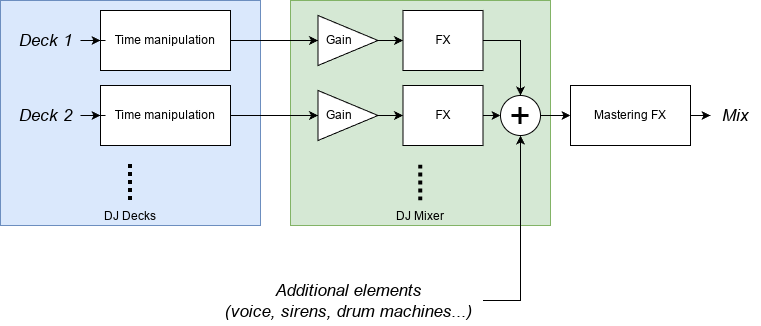
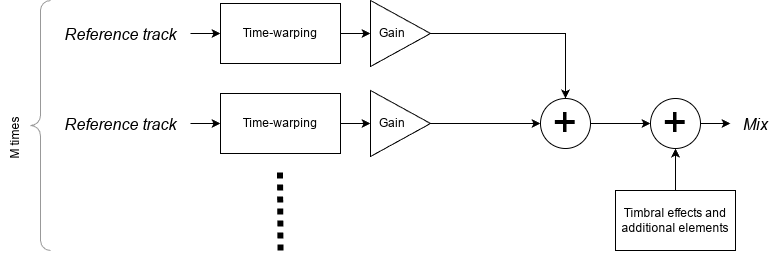

# Factorisation de matrices non-négatives (NMF)

## Non-negative Matrix Factorization (NMF)

**Principe**: sachant une matrice $\mathbf{V}$, estimer $\mathbf{W}$ et $\mathbf{H}$ tels que:

$$\mathbf{V} \approx \mathbf{WH}$$

---

**Application à l'audio**:

- Séparation de sources
- Transcription
- Restauration

## Beta-NMF [@fevotteAlgorithmsNonnegativeMatrix2011]

Soient $\mathbf{W}_{F \times K}$, $\mathbf{H}_{K \times N}$ et $\mathbf{V}_{F \times N}$.

**Objectif**: minimiser la distance $d$ entre $\mathbf{V}$ et $\mathbf{W}\mathbf{H}$:

$$ \min_{\mathbf{W},\mathbf{H}} D(\mathbf{V}|\mathbf{W}\mathbf{H}) \text{ avec } \mathbf{W} \ge 0, \mathbf{H} \ge 0$$

**Distance**: $\beta$-divergence

$$ D_{\beta}(\mathbf{V}|\mathbf{W}\mathbf{H}) = \sum_{f=1}^{F}\sum_{n=1}^{N} d(\mathbf{V}_{fn}|(\mathbf{WH})_{fn})$$
$$d(x|y) =
\begin{cases}
\frac{1}{\beta (\beta-1)} (x^{\beta} + (\beta-1)y^{\beta} - \beta x y^{\beta-1}) & \beta \neq \{0,1\} \\
x \log \frac{x}{y} - x + y & \beta = 1 \\
\frac{x}{y} - \log {x}{y} - 1 & \beta = 0
\end{cases}
$$

## Algorithme d'inférence (MU)

notation: $\mathbf{\hat{V}}=\mathbf{WH}$

1. Initialiser $\mathbf{W} \geq 0$ et $\mathbf{H} \geq 0$
2. Mettre à jour successivement $\mathbf{W}$ et $\mathbf{H}$[^notation]:
$$\mathbf{H} \leftarrow \mathbf{H} \times \frac{\mathbf{W}^T(\mathbf{\hat{V}}^{\beta-2}\times\mathbf{V})}{\mathbf{W}^T \mathbf{\hat{V}}^{\beta-1}}$$
$$\mathbf{W} \leftarrow \mathbf{W} \times \frac{(\mathbf{\hat{V}}^{\beta-2} \times \mathbf{V}) \mathbf{H}^T}{\mathbf{\hat{V}}^{\beta-1} \mathbf{H}^T}$$
3. Répéter l'étape 2 jusqu'à convergence ou nombre d'itérations maximum

[^notation]: $\cdot \times \cdot$ et $\frac{\ \cdot\ }{\ \cdot\ }$ sont élément par élément

## Représentation spectrale et choix de la distance

Pour de l'audio [@fevotteNonnegativeMatrixFactorization2009]:

- divergence d'Itakura-Saito ($\beta = 0$)
- spectres de puissance

# Formulation du problème

## Objectif

**Sachant**

- Un enregistrement d'un mix DJ (*mix*)
- Les enregistrements des morceaux composant le mix (*reference tracks*)

**Estimer**

- Les transformations temporelles (alignement, boucles, sauts)
- Les transformations de timbre (pitch shift, filtres, ...)
- Les éléments supplémentaires (voix, foule, ...)
- Leur évolution au cours du temps

## Matériels et logiciels DJ typiques

{height=50%}

---

## Formulation NMF: transcription et séparation de sources

:::::::::::::: {.columns}
::: {.column width="40%"}

{height=70%}

:::
::: {.column width="40%"}

- matrices de bases $\mathbf{W}_i$: spectre de puissance des morceaux de référence
- matrices d'activations $\mathbf{H}_i$: transformations temporelles (timestretch, boucles, delays...) + gain
- $\mathbf{V}_i$: spectres transformés temporellement
- fonctions $f_i$: le reste des transformations (filtres, pitch, distortion...)
:::
::::::::::::::

---

:::::::::::::: {.columns}
::: {.column width="40%"}

{height=70%}

:::
::: {.column width="40%"}

$$\mathbf{V} = \sum_{i=1}^M f_i(\mathbf{W}_i \mathbf{H}_i)$$

Si de plus $\forall i \ f_i = \mathbf{1}$ alors:

$$\mathbf{V} = \sum_{i=1}^M \mathbf{W}_i \mathbf{H}_i
  = \underbrace{[\mathbf{W}_1|\mathbf{W}_2|...|\mathbf{W}_M]}_{\mathbf{W}}
  \underbrace{\begin{bmatrix}
    \mathbf{H}_{1} \\
    \mathbf{H}_{2} \\
    \vdots \\
    \mathbf{H}_{M}
  \end{bmatrix}}_{\mathbf{H}}
$$

:::
::::::::::::::

---

Si tous les morceaux sont connus, on fixe les $\mathbf{W}_i$

$$ \mathbf{V} = {\color{orange}\underbrace{[\mathbf{W}_1|\mathbf{W}_2|...|\mathbf{W}_M]}_\text{fixé}}
  {\color{blue}\underbrace{
    \begin{bmatrix}
    \mathbf{H}_{1} \\
    \mathbf{H}_{2} \\
    \vdots \\
    \mathbf{H}_{M}
  \end{bmatrix}
  }_\text{estimé}}
$$

## Éléments inconnus

S'il y a des éléments inconnus, on les représente par un couple supplémentaire $(\mathbf{W}_a, \mathbf{H}_a)$

$$ \mathbf{V} = {\color{orange}\underbrace{[\mathbf{W}_1|\mathbf{W}_2|...|\mathbf{W}_M}_\text{fixé}}
  {\color{blue}\underbrace{|\mathbf{W}_a]
    \begin{bmatrix}
    \mathbf{H}_{1} \\
    \mathbf{H}_{2} \\
    \vdots \\
    \mathbf{H}_{M} \\
    \mathbf{H}_a
  \end{bmatrix}
  }_\text{estimé}}
$$

## Reconstruction des sources

"source" $i$ = le morceau $i$ transformé temporellement

$$\mathbf{V}_i = \mathbf{V} \times \frac{\mathbf{W}_i\mathbf{H}_i}{\mathbf{WH}}$$

=> évaluation de la qualité de la séparation

## Résultat espéré

{height=80%}

## Estimation des paramètres

**Volume relatif du morceau $i$ à la frame $n$**

$\approx$ ampltiude relative de la colonne $n$ de $\mathbf{H}_i$

$$g_i(n) = \frac{\sum_{k=1}^K (\mathbf{H}_i)_{kn}}{\sum_{k=1}^K \mathbf{H}_{kn}}$$

**Position dans le morceau $i$ à la frame $n$**

$\approx$ centre de masse de la colonne $n$ de $\mathbf{H}_i$

$$\tau_i(n) = \frac{\sum_{k=1}^K k(\mathbf{H}_i)_{kn}}{\sum_{k=1}^K (\mathbf{H}_i)_{kn}}$$

# Essais & Résultats

---

{height=70%}

On retrouve bien $\mathbf{H}=\mathbf{H}_1 = \mathbf{I}$

---

{height=70%}

[ref.wav](results/boucles/original.wav) [mix.wav](results/boucles/boucled.wav) [est.wav](results/boucles/estimated-0.wav)

---

{height=70%}

[ref.wav](results/timestretch/nuttah.wav) [mix.wav](results/timestretch/nuttah-timestretch.wav) [est.wav](results/timestretch/estimated-0.wav)

---

{height=70%}

[ref0.wav](results/fondu/linear-mix-1.wav) [ref1.wav](results/fondu/linear-mix-2.wav) [mix.wav](results/fondu/linear-mix.wav) [est0.wav](results/fondu/estimated-0.wav) [est1.wav](results/fondu/estimated-1.wav)

---

{height=70%}

[bruit.wav](results/bruit-no-wa/maya.wav) [est0.wav](results/bruit-no-wa/estimated-0.wav) [est1.wav](results/bruit-no-wa/estimated-1.wav)

---

{height=70%}

[est0.wav](results/bruit-wa/estimated-0.wav) [est1.wav](results/bruit-wa/estimated-1.wav) [est2.wav](results/bruit-wa/estimated-2.wav)

# Pistes d'amélioration

## Complexité

- **complexité mémoire**
  - NMF en mini-batchs [@cichockiFastLocalAlgorithms2009]
- **complexité de calcul**
  - NMF multi-résolution [@leplatMultiResolutionBetaDivergenceNMF2022]
  - Essayer d'autres représentations spectrales
  - Utiliser la connaissance a priori de position approximative des morceaux dans le mix

## Robustesse

- Convergence de $\mathbf{H}$ vers la forme voulue
  - influencer par l'initialisation (pour l'instant aléatoire)
  - régularisation [@fevotteSingleChannelAudioSource2018a;@fevotteMajorizationminimizationAlgorithmSmooth2011]
  - traiter $\mathbf{H}$ entre chaque itération [@driedgerLETITBEE2015]

## Estimation ou robustesse aux effets supplémentaires

- invariance au pitch: NMF2D [@aarabiMusicRetilerUsing2018]
- estimation aveugle des $f_i$ ?
