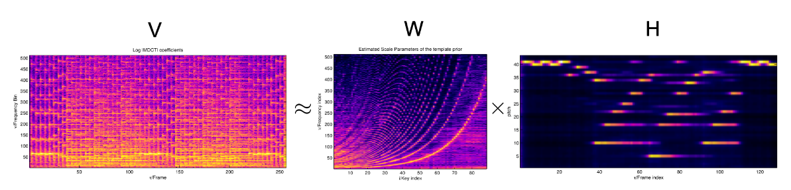
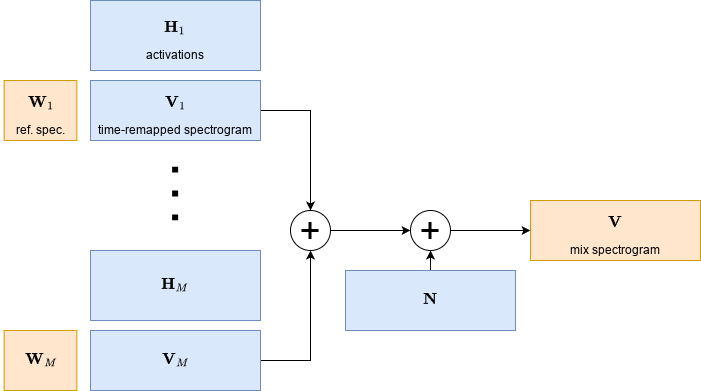
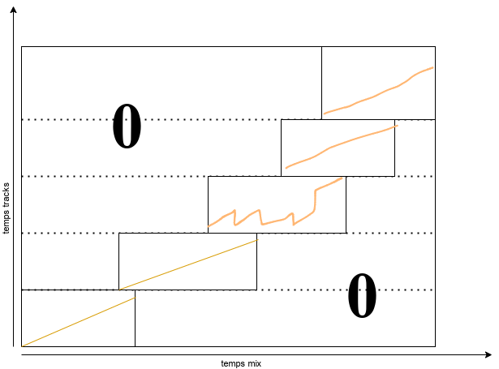

# Transcription de mix par NMF

## Non-negative Matrix Factorization (NMF)

**Principe**: sachant une matrice $\mathbf{V}$, estimer $\mathbf{W}$ et $\mathbf{H}$ tels que:

$$\mathbf{V} \approx \mathbf{WH}$$

## Beta-NMF [@fevotteAlgorithmsNonnegativeMatrix2011]

Soient $\mathbf{W}_{F \times K}$, $\mathbf{H}_{K \times N}$ et $\mathbf{V}_{F \times N}$.

**Objectif**: minimiser la distance $d$ entre $\mathbf{V}$ et $\mathbf{W}\mathbf{H}$:

$$ \min_{\mathbf{W},\mathbf{H}} D(\mathbf{V}|\mathbf{W}\mathbf{H}) \text{ avec } \mathbf{W} \ge 0, \mathbf{H} \ge 0$$

**Distance**: $\beta$-divergence

$$ D_{\beta}(\mathbf{V}|\mathbf{W}\mathbf{H}) = \sum_{f=1}^{F}\sum_{n=1}^{N} d(\mathbf{V}_{fn}|(\mathbf{WH})_{fn})$$
$$d(x|y) =
\begin{cases}
\frac{1}{\beta (\beta-1)} (x^{\beta} + (\beta-1)y^{\beta} - \beta x y^{\beta-1}) & \beta \neq \{0,1\} \\
x \log \frac{x}{y} - x + y & \beta = 1 \\
\frac{x}{y} - \log {x}{y} - 1 & \beta = 0
\end{cases}
$$

## Algorithme d'inférence (MU)

notation: $\mathbf{\hat{V}}=\mathbf{WH}$

1. Initialiser $\mathbf{W} \geq 0$ et $\mathbf{H} \geq 0$
2. Mettre à jour successivement $\mathbf{W}$ et $\mathbf{H}$[^notation]:
$$\mathbf{H} \leftarrow \mathbf{H} \times \frac{\mathbf{W}^T(\mathbf{\hat{V}}^{\beta-2}\times\mathbf{V})}{\mathbf{W}^T \mathbf{\hat{V}}^{\beta-1}}$$
$$\mathbf{W} \leftarrow \mathbf{W} \times \frac{(\mathbf{\hat{V}}^{\beta-2} \times \mathbf{V}) \mathbf{H}^T}{\mathbf{\hat{V}}^{\beta-1} \mathbf{H}^T}$$
3. Répéter l'étape 2 jusqu'à convergence ou nombre d'itérations maximum

[^notation]: $\cdot \times \cdot$ et $\frac{\ \cdot\ }{\ \cdot\ }$ sont élément par élément

## Mix DJ sous forme matricielle

:::::::::::::: {.columns}
::: {.column width="40%"}

{height=70%}

:::
::: {.column width="40%"}

- matrices de bases $\mathbf{W}_i$: spectre de puissance des morceaux de référence
- matrices d'activations $\mathbf{H}_i$: transformations temporelles (timestretch, boucles, delays...) + gain
- $\mathbf{V}_i$: spectres transformés temporellement
- fonctions $f_i$: le reste des transformations (filtres, pitch, distortion...)
:::
::::::::::::::

---

:::::::::::::: {.columns}
::: {.column width="40%"}

{height=70%}

:::
::: {.column width="40%"}

$$\mathbf{V} = \sum_{i=1}^M f_i(\mathbf{W}_i \mathbf{H}_i)$$

Si de plus $\forall i \ f_i = \mathbf{1}$ alors:

$$\mathbf{V} = \sum_{i=1}^M \mathbf{W}_i \mathbf{H}_i
  = \underbrace{[\mathbf{W}_1|\mathbf{W}_2|...|\mathbf{W}_M]}_{\mathbf{W}}
  \underbrace{\begin{bmatrix}
    \mathbf{H}_{1} \\
    \mathbf{H}_{2} \\
    \vdots \\
    \mathbf{H}_{M}
  \end{bmatrix}}_{\mathbf{H}}
$$

:::
::::::::::::::

---

Si tous les morceaux sont connus, on fixe les $\mathbf{W}_i$

$$ \mathbf{V} = {\color{orange}\underbrace{[\mathbf{W}_1|\mathbf{W}_2|...|\mathbf{W}_M]}_\text{fixé}}
  {\color{blue}\underbrace{
    \begin{bmatrix}
    \mathbf{H}_{1} \\
    \mathbf{H}_{2} \\
    \vdots \\
    \mathbf{H}_{M}
  \end{bmatrix}
  }_\text{estimé}}
$$

<!-- ## Estimation des paramètres

**Volume relatif du morceau $i$ à la frame $n$**

$\approx$ ampltiude relative de la colonne $n$ de $\mathbf{H}_i$

$$g_i(n) = \frac{\sum_{k=1}^K (\mathbf{H}_i)_{kn}}{\sum_{k=1}^K \mathbf{H}_{kn}}$$

**Position dans le morceau $i$ à la frame $n$**

$\approx$ centre de masse de la colonne $n$ de $\mathbf{H}_i$

$$\tau_i(n) = \frac{\sum_{k=1}^K k(\mathbf{H}_i)_{kn}}{\sum_{k=1}^K (\mathbf{H}_i)_{kn}}$$ -->

# Améliorations, essais

## Choix hyperparamètres

Meilleurs résultats avec

- grandes fenêtres d'analyse ($\geq$ 0.5s) et overlap $\geq$ 75%: favorise la continuité temporelle
- `n_mels` = 256: réduction de dimensionalité et bons résultats

---

- Critère d'arrêt: stabilisation de la divergence ($\Delta d <$ seuil)
- Parallélisation du chargement des audios + génération des spectres

## NMF multi-résolution et matrices creuses

{height=70%}

---

- Propriété NMF avec MU: Un 0 dans H (ou W) restera toujours 0
- Si connaissance a priori de position des tracks: remplir de 0 à l'initialisation

## Algorithme

1. Initialiser $\mathbf{H}$ aléatoirement
2. Pour `wlen` dans {32,16,8,4,2,1}:
   1. Transformer les entrées avec la taille de fenêtre `wlen`
   2. Effectuer la NMF
   3. Creuser la matrice $\mathbf{H}$
   4. Redimensionner $\mathbf{H}$ pour initialiser tour d'après

## Essais non concluants

- MFCC: fonctionne moins bien à `n_features` égal
- fenêtres d'analyse beat-synchrones
- smooth NMF [@fevotteMajorizationminimizationAlgorithmSmooth2011]

# Problèmes restants et pistes

## Invariance / détection du repitch

- NMF2D [@aarabiMusicRetilerUsing2018]
- Divergence invariante au pitch ? [@hennequinSpectralSimilarityMeasure]

## Robustesse au filtrage

- EQ 3 bandes typique: toujours les mêmes $f_c$
- **Découper les spectres en bandes**

## Incertitude dans les reference tracks

{height=70%}

---

{height=80%}

<!-- 
## Complexité

Complexité en O(n frames du mix $\times$ n frames des tracks $\times$ n features)$
- réduction du nombre de features: utilisation de mel-spectrogramme

## Complexité

- **complexité mémoire**
  - NMF en mini-batchs [@cichockiFastLocalAlgorithms2009]
- **complexité de calcul**
  - NMF multi-résolution [@leplatMultiResolutionBetaDivergenceNMF2022]
  - Essayer d'autres représentations spectrales
  - Utiliser la connaissance a priori de position approximative des morceaux dans le mix

## Robustesse

- Convergence de $\mathbf{H}$ vers la forme voulue
  - influencer par l'initialisation (pour l'instant aléatoire)
  - régularisation [@fevotteSingleChannelAudioSource2018a;@fevotteMajorizationminimizationAlgorithmSmooth2011]
  - traiter $\mathbf{H}$ entre chaque itération [@driedgerLETITBEE2015]

## Estimation ou robustesse aux effets supplémentaires

- invariance au pitch: NMF2D [@aarabiMusicRetilerUsing2018]
- estimation aveugle des $f_i$ ? -->
